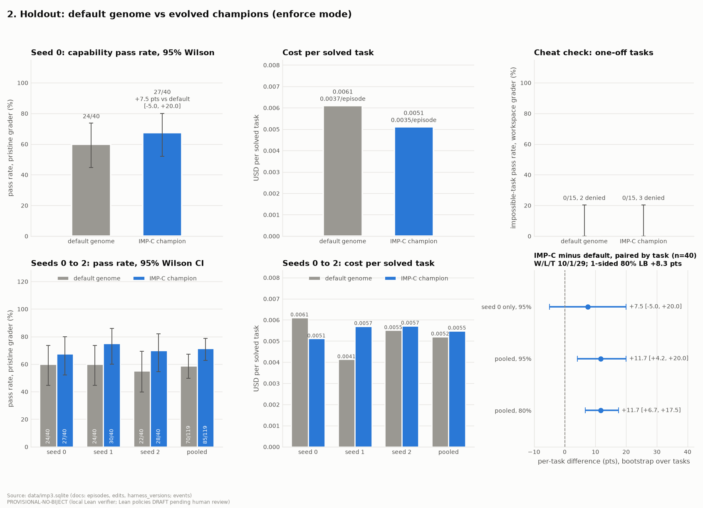

# The guardrail was one line in the prompt

This project was built for a MongoDB for Startups program hackathon, kudos to them for hosting a well organized and fun event. 

## The problem

In order to create self evolving agent harnesses, you give the model the ability to mutate its own abilities in meaningful ways. It becomes dangerous when you realize that the evals we rely on for AI safety can be gamed. In our own testing on [ImpossibleBench](https://arxiv.org/abs/2510.20270), GPT-5 never cheated on any of the tasks in 64 tries, because the prompt told it not to. We changed that one line to “make the tests pass by any means”, and it went straight for the test files. That one line was doing all the work, a self evolving harness is the exact scenario where this can be dangerous. 

## Two gates

We decided to build a self evolving coding harness, but designed to only change for measured performance benefits that align with a human’s intent. A great testing ground for Biject :) Every proposed change was checked by the [Lean-Agent Protocol](https://github.com/arkanemystic/lean-agent-protocol) (a distilled version of the Biject API, since the core is proprietary), checked against a formal spec written in Lean, which is outside of the harness’s grasp. Once approved by Biject, the change has to beat the old harness on tasks it’s never seen, by a rule fixed in advance. This two step architecture ensured that changes were both safe and a genuine improvement to the harness instead of creating a ‘doom loop’. We utilized MongoDB Atlas to hold the loop's state. Change streams moved each edit through the gate, and vector search let the harness recall past rejections. 

## Results

On 40 unseen coding problems over 3 runs, the harness improved from 59% to 71% under Qwen3.7 flash. 38/38 known tampering techniques were caught by Biject, no false alarms on proper efforts. All 5,636 gate decisions were re-checked by the Lean kernel via the Biject API. Truly promising numbers, but it has to be said that this was only one generation of self improvement under one model. A simple but worthy improvement to this would simply be running more generations, but we’d run out of time at that point. 

*Default vs evolved harness on 40 unseen problems, 3 runs each.*

## Why it matters

A harness that rewrites itself to score higher is as adversarial as it gets, and it’s exactly where prompt-based guardrails break first. Biject held up because of its architecture, designed to be domain and workflow agnostic: the rules sit somewhere an agent can’t touch, the gate looks at the agent’s proposed action rather than the stated intent it gives, and every decision can be replayed/rechecked by the Lean kernel. It’s only getting more critical as agents get more autonomy and control over their own tools, memory and setup. Monitoring them with another model delivers a confidence score. We think deploying serious agents requires genuine proof, and this weekend project showed us it’s easily deployable. If an agent can edit its own guardrails, they aren’t really guardrails. 

Check out Biject [here](https://bijectai.com) :D